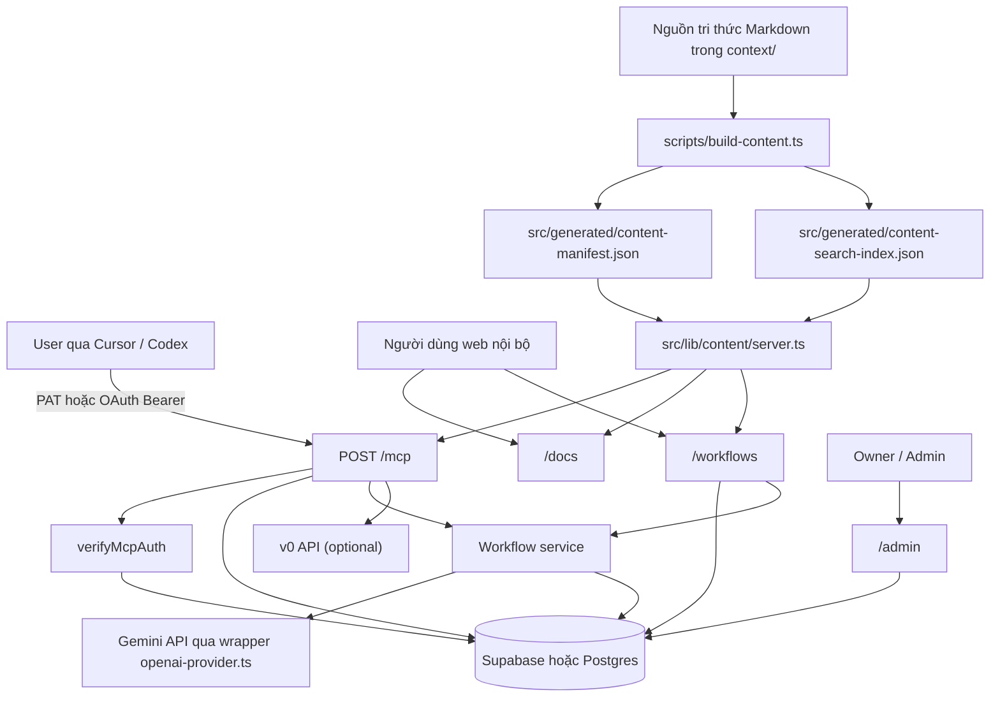
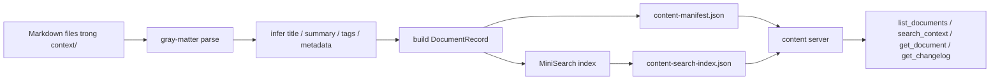
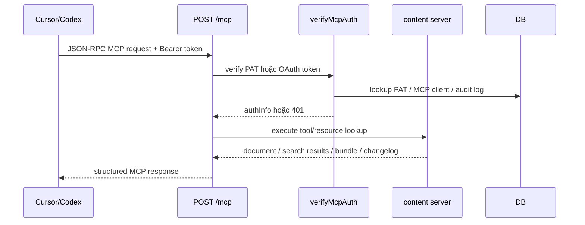
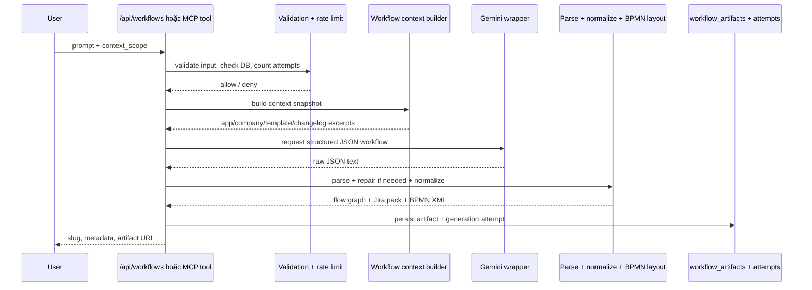

# BA Agents MCP - Project Handoff

## 1. Thông tin tổng quan

- **Project name:** BA Agents MCP
- **Repository:** `ba-agents-mcp`
- **Version hiện tại trong code:** `0.1.0`
- **Loại sản phẩm:** Next.js app dùng để đóng gói, tìm kiếm, phân phối và quản trị BA/PM knowledge base cho BSS B2B Suite qua MCP, web docs và workflow generator
- **Mục tiêu bàn giao:** giúp người tiếp quản hiểu được bối cảnh business, kiến trúc kỹ thuật, luồng logic, dữ liệu, auth, vận hành và các điểm cần chú ý khi tiếp tục phát triển hoặc duy trì dự án

## 2. TL;DR

BA Agents là một lớp phân phối tri thức nội bộ cho BSS B2B Suite. Repo này không chỉ chứa tài liệu BA/PM trong `context/`, mà còn có một ứng dụng Next.js để:

1. Index toàn bộ tài liệu Markdown thành manifest + search index.
2. Expose knowledge base đó qua MCP server tại `/mcp`.
3. Cung cấp trang public docs tại `/docs` và metadata tại `/server.json`.
4. Cung cấp trang admin để quản lý admin users, MCP clients, personal access tokens, audit logs và AI provider key.
5. Cung cấp workflow generator để biến prompt thành:
   - workflow graph
   - BPMN XML
   - Jira-ready Epic/Story/Task pack
6. Cung cấp integration tùy chọn với v0 để sinh reference UI low-fidelity.

Nếu nhìn ở mức cao nhất, đây là một sản phẩm "knowledge infrastructure + internal delivery surface" cho team PM/BA và các AI client như Cursor/Codex.

## 3. Bối cảnh business và phạm vi domain

### 3.1. Bối cảnh business

Knowledge base phục vụ BSS Commerce B2B Suite trên Shopify, tập trung vào 3 app chính:

- **Lock:** access control, hide price, theme hiding, checkout guardrails.
- **Quote / Quick:** RFQ, quote operations, quick order, quote history, quote-to-order.
- **Solution:** registration, segmentation, pricing engine, quantity rules, net terms, import/export.

Ngoài app-specific context, hệ thống còn quản lý:

- company context
- customer segments
- PRD/discovery/help-doc/product-analysis templates
- changelog merchant-facing
- competitor context theo app

### 3.2. Mục tiêu sản phẩm

- Làm một nguồn tri thức chuẩn hóa để AI có thể truy xuất đáng tin cậy.
- Giảm việc PM/BA phải copy-paste tài liệu thủ công.
- Chuẩn hóa output như PRD, discovery synthesis, help doc, strategy analysis.
- Tạo thêm artifact có cấu trúc như workflow diagram và Jira pack.
- Hỗ trợ quản trị truy cập qua admin, PAT và OAuth client allowlist.

### 3.3. In-scope của hệ thống hiện tại

- Index và search tài liệu trong `context/`
- MCP server read-only cho knowledge retrieval
- Public docs hướng dẫn kết nối MCP
- Admin dashboard vận hành access/auth/provider
- Workflow generation lưu artifact
- v0 reference UI generation

### 3.4. Out-of-scope

- Không phải workflow engine thực thi thật
- Không phải CMS đầy đủ để author content trên web
- Không phải sản phẩm merchant-facing
- Không phải app runtime cho Lock/Quote/Solution
- Không phải data warehouse hay analytics platform

## 4. Inventory tài nguyên tri thức

Tại thời điểm tôi rà repo, search manifest đang index **25 tài liệu** trong `context/`:

- `1` company document
- `3` app skill documents
- `3` app context documents
- `3` competitive context documents
- `7` shared template/reference documents
- `5` changelog documents
- `3` shared reference documents khác

Phân bố theo app trong manifest:

- `lock`: 4 tài liệu
- `quote`: 4 tài liệu
- `solution`: 4 tài liệu
- `cross-suite / shared`: 13 tài liệu

### 4.1. Canonical content layout

```text
context/
  COMPANY.md
  references/
    CUSTOMER_SEGMENTS.md
    discovery/
    prd/
  help-docs/
  product-analysis/
  lock/
  quote/
  solution/
  changelog/
```

### 4.2. URI conventions quan trọng

Hệ thống map file Markdown sang stable `bss://` URI. Một số URI quan trọng:

- `bss://company`
- `bss://segments`
- `bss://template/prd`
- `bss://template/discovery`
- `bss://template/help-doc`
- `bss://app/lock/context`
- `bss://app/quote/context`
- `bss://app/solution/context`
- `bss://app/<app>/skill`
- `bss://app/<app>/competitive`
- `bss://changelog/<slug>`
- `bss://catalog`

Ý nghĩa của việc dùng `bss://` là mọi MCP client có thể gọi `get_document` bằng URI ổn định, không phụ thuộc path file nội bộ.

## 5. Cấu trúc hệ thống tổng thể

### 5.1. Kiến trúc mức cao



### 5.2. Repo structure nên nắm

```text
src/app/                  Next.js routes và pages
src/components/           UI components cho admin/workflows
src/lib/content/          logic content indexing/search/bundle
src/lib/mcp/              MCP server registration
src/lib/auth/             admin auth + MCP auth + PAT + audit
src/lib/db/               schema và query layer
src/lib/workflows/        workflow generation, normalize, BPMN
src/lib/v0/               integration với v0
src/lib/security/         secret encryption
scripts/build-content.ts  build search manifest từ context/
context/                  nguồn tri thức canonical
drizzle/                  SQL migrations
output/                   ví dụ artifact text đã sinh
ui-mockups/               ví dụ handoff/wireframe/mockup output
```

## 6. Luồng logic cốt lõi của dự án

### 6.1. Luồng build tri thức



Giải thích:

- `scripts/build-content.ts` scan toàn bộ `context/`.
- Mỗi file được parse frontmatter + content.
- Hệ thống tự suy ra `kind`, `app`, `uri`, `summary`, `tags`, `metadata`.
- Kết quả ghi ra 2 file generated:
  - `src/generated/content-manifest.json`
  - `src/generated/content-search-index.json`

Đây là bước bắt buộc trước `dev`, `build`, `typecheck`.

### 6.2. Luồng dùng MCP



### 6.3. Luồng workflow generation



## 7. Public surfaces và chức năng người dùng

### 7.1. `/docs`

Trang hướng dẫn public cho end user:

- MCP URL
- cách dùng với Cursor / Codex
- tool inventory
- prompt inventory
- quick examples

Trang này là landing page chính của app; `src/app/page.tsx` re-export trực tiếp từ `/docs`.

### 7.2. `/server.json`

Expose metadata của MCP server:

- name
- title
- description
- version
- transport URL
- authentication metadata link
- docs URL

Mục tiêu là cho MCP registry / client discovery.

### 7.3. `/mcp`

Đây là endpoint MCP chính:

- chỉ nhận `POST`
- sử dụng `Streamable HTTP`
- trả `405` cho `GET/PUT/DELETE`
- yêu cầu Bearer token hợp lệ

### 7.4. `/admin`

Trang nội bộ cho admin/owner để:

- quản lý admin users
- quản lý MCP clients allowlist
- tạo/sửa/xóa PAT
- xem audit logs
- cấu hình AI provider key

### 7.5. `/workflows`

Trang gallery + generator cho workflow artifact:

- nhập prompt
- chọn context scope
- sinh workflow
- xem artifact gần nhất

### 7.6. `/workflows/[slug]`

Trang chi tiết artifact:

- BPMN viewer
- prompt gốc
- Epic
- Stories + Tasks
- context snapshot
- download BPMN XML

## 8. MCP resources, tools và prompts

### 8.1. Registered resources

- Toàn bộ `context/*.md` được register thành MCP resource động.
- Ngoài ra có resource đặc biệt `bss://catalog`.

### 8.2. MCP tools hiện có

| Tool | Mục đích |
| --- | --- |
| `list_documents` | liệt kê tài liệu theo filter metadata |
| `get_document` | lấy một document theo `bss://` URI |
| `search_context` | full-text search + metadata bias |
| `get_changelog` | tìm changelog merchant-facing |
| `suggest_context_bundle` | gợi ý bộ tài liệu tối thiểu cho một task |
| `get_resource_catalog` | trả inventory summary của resource index |
| `generate_workflow_artifact` | sinh và lưu workflow artifact |
| `generate_reference_ui` | gọi v0 để sinh low-fidelity reference UI |

### 8.3. Built-in prompts

| Prompt | Mục đích |
| --- | --- |
| `draft_prd` | draft PRD / RQM |
| `synthesize_discovery` | tổng hợp discovery |
| `write_help_doc` | viết help doc merchant-facing |
| `analyze_strategy` | phân tích strategy / framework |

### 8.4. Quy tắc output đáng chú ý

- Workflow generator ép output Jira titles theo prefix như `New:`, `Improve:`, `Bug:`, `Tech:`, `Doc:`, `Research:`, `Discuss:`, `Test:`.
- Jira title phải bằng tiếng Anh.
- Jira description/acceptance content dùng tiếng Việt.
- Workflow chỉ hỗ trợ BPMN subset hẹp:
  - `start_event`
  - `task`
  - `exclusive_gateway`
  - `end_event`

## 9. Auth, access control và security model

### 9.1. Admin authentication

Admin sign-in dùng OIDC qua NextAuth:

- provider id: `oidc`
- scope mặc định: `openid profile email admin:manage`
- bootstrap admin qua `ADMIN_BOOTSTRAP_EMAILS`
- chỉ email thuộc bootstrap list hoặc đã có trong `admin_users` mới sign in được

### 9.2. MCP authentication

MCP hỗ trợ 2 loại Bearer token:

1. **Personal Access Token**
   - prefix `bss_pat_`
   - hash SHA-256 trước khi lưu
   - chỉ lộ token value đúng 1 lần lúc tạo
   - có thể disable / set expiry / scope

2. **OAuth access token**
   - verify JWT qua external OIDC issuer
   - check audience
   - check required scope
   - check `azp/client_id`
   - client phải tồn tại trong `mcp_clients` và status `active`

### 9.3. Audit logging

Audit log ghi:

- event type
- subject/email/clientId
- route
- outcome
- reason
- hashed IP
- user agent

Hệ thống hash IP thay vì lưu IP raw.

### 9.4. Secret management

Provider secret được encrypt bằng:

- thuật toán `AES-256-GCM`
- key derive từ `ADMIN_SECRETS_ENCRYPTION_KEY`
- lưu masked preview thay vì lộ full secret

## 10. Workflow generation subsystem

### 10.1. Chức năng

Input:

- `prompt`
- `contextScope`: `lock | quote | solution | cross_suite`

Output:

- artifact metadata
- normalized flow graph
- Jira pack
- BPMN XML
- context snapshot

### 10.2. Constraint kỹ thuật

- Prompt tối đa: `2000` ký tự
- Nodes tối đa: `30`
- Edges tối đa: `50`
- Stories tối đa: `5`
- Tasks tối đa: `12`
- Phải có đúng `1` start event
- Mọi node phải reachable từ start event

### 10.3. Context snapshot cho generation

Generator không gọi search tự do. Nó build snapshot từ nguồn chuẩn:

- app context hoặc company context
- PRD template
- changelog gần nhất

Điều này giúp output ổn định và có scope rõ hơn.

### 10.4. Rate limit

Theo source hiện tại, API workflow public áp dụng rate limit theo IP hash:

- tối đa `5` lần / giờ
- tối đa `20` lần / ngày

### 10.5. Repair loop

Nếu model trả output sai schema:

- hệ thống parse thất bại
- tạo prompt repair
- gọi model lần 2
- nếu vẫn sai thì fail request

## 11. v0 reference UI subsystem

### 11.1. Mục đích

Sinh UI reference rất cơ bản cho BA/PM discussion, không phải production UI.

### 11.2. Input

- `confirmed_task`
- tùy chọn: `app`, `feature_name`, `feature_area`, `goal`, `audience`, `notes`

### 11.3. Hành vi

- hỗ trợ nhiều API key qua `V0_API_KEYS`
- rotate key round-robin
- tự thử key tiếp theo nếu gặp lỗi auth/quota/rate limit/network
- ép prompt để output TSX đơn giản, tránh malformed JSX

### 11.4. Output

- status
- prompt đã gửi
- chat URL
- demo URL
- version id
- file list
- notes / error

## 12. Data model

### 12.1. Bảng chính

| Table | Vai trò |
| --- | --- |
| `admin_users` | danh sách admin nội bộ |
| `mcp_clients` | allowlist OAuth clients được dùng MCP |
| `auth_audit_logs` | log auth/admin access events |
| `personal_access_tokens` | PAT cho end users |
| `provider_api_keys` | secret lưu cho AI provider |
| `workflow_artifacts` | artifact workflow đã sinh |
| `workflow_generation_attempts` | log generation attempts và rate-limit |

### 12.2. Các enum chính

- `admin_role`: `owner`, `admin`
- `record_status`: `active`, `disabled`
- `workflow_context_scope`: `lock`, `quote`, `solution`, `cross_suite`
- `workflow_generation_outcome`: `success`, `error`, `rate_limited`, `unavailable`, `invalid_input`
- `provider_api_key_provider`: hiện chỉ có `openai`
- `provider_api_key_validation_status`: `valid`, `invalid`

### 12.3. Persistence strategy

Ứng dụng hỗ trợ 2 đường persistence:

1. **Supabase admin store**
   - ưu tiên nếu có `SUPABASE_URL` và `SUPABASE_SERVICE_ROLE_KEY`
2. **Vercel Postgres / Drizzle**
   - fallback nếu có `POSTGRES_URL`

Logic query layer luôn check `isSupabaseConfigured()` trước, nếu không mới dùng Drizzle.

## 13. API/route inventory

### 13.1. Public / semi-public routes

| Route | Mục đích |
| --- | --- |
| `/docs` | user documentation |
| `/server.json` | MCP registry metadata |
| `/mcp` | MCP endpoint |
| `/workflows` | workflow gallery + generation UI |
| `/api/workflows` | list + create workflow artifacts |
| `/api/workflows/{slug}` | detail artifact hoặc download BPMN XML |
| `/docs/openapi.json` | HTTP API description |

### 13.2. Admin routes

| Route | Mục đích |
| --- | --- |
| `/api/admin/admin-users` | list/create/update admin users |
| `/api/admin/mcp-clients` | list/create/update allowlisted MCP clients |
| `/api/admin/personal-access-tokens` | list/create/update/delete PAT |
| `/api/admin/openai-key` | get/put/delete AI provider key |
| `/api/admin/audit-logs` | list audit logs |

## 14. Environment variables cần thiết

### 14.1. Auth / app identity

```env
AUTH_SECRET=
NEXTAUTH_URL=
APP_BASE_URL=

AUTH_OIDC_ISSUER=
AUTH_OIDC_CLIENT_ID=
AUTH_OIDC_CLIENT_SECRET=
AUTH_OIDC_AUDIENCE=
MCP_RESOURCE_AUDIENCE=
```

### 14.2. Data store / security

```env
POSTGRES_URL=
SUPABASE_URL=
SUPABASE_SERVICE_ROLE_KEY=
ADMIN_SECRETS_ENCRYPTION_KEY=
```

### 14.3. Optional integrations

```env
V0_API_KEYS=
V0_API_KEY=
ADMIN_BOOTSTRAP_EMAILS=
```

### 14.4. Runtime defaults đáng nhớ

- MCP scope mặc định: `mcp:read`
- Admin scope mặc định: `admin:manage`
- Base URL fallback: `http://localhost:3000`
- Server identity fallback:
  - name: `io.bsscommerce/ba-agents`
  - title: `BA Agents MCP`
  - description: `Remote read-only MCP server for BSS BA and PM context.`

## 15. Setup và vận hành

### 15.1. Local development

```bash
npm install
npm run dev
```

Quan trọng:

- `dev`, `build`, `typecheck` đều chạy `npm run content:build` trước.
- Nếu sửa tài liệu trong `context/`, cần rebuild content để manifest/index cập nhật.

### 15.2. Database setup

Theo README, cần chạy lần lượt:

1. `drizzle/0000_initial.sql`
2. `drizzle/0001_personal_access_tokens.sql`
3. `drizzle/0002_pat_token_value.sql`
4. `drizzle/0003_workflows_and_provider_keys.sql`
5. `drizzle/0004_provider_key_model_name.sql`

### 15.3. Deployment checklist đề xuất

1. Set env vars ở hosting.
2. Run DB migrations.
3. Deploy app.
4. Sign in `/admin` bằng bootstrap email.
5. Tạo / kiểm tra admin users.
6. Tạo PAT hoặc MCP client allowlist.
7. Cấu hình provider key cho workflow generation.
8. Test `/docs`, `/server.json`, `/mcp`.
9. Test tạo một workflow artifact thật.

## 16. Domain coverage trong knowledge base

### 16.1. Lock

Coverage chính:

- login lock
- hide price / hide Add to Cart
- product / collection gating
- passcode / request access / secret link
- theme hiding profile
- checkout lock
- payment / shipping method guardrails

### 16.2. Quote / Quick

Coverage chính:

- RFQ button/form
- modal vs dedicated page
- quote operations
- quick order
- CSV bulk order
- quote history
- quote-to-order

### 16.3. Solution

Coverage chính:

- registration form
- customer segmentation
- price list / custom pricing / volume pricing
- quantity increment / order limit
- shipping rates
- net terms
- manual orders
- import/export

## 17. Các file và module cần hiểu đầu tiên khi tiếp quản

### 17.1. Nếu tiếp quản product logic

- `context/COMPANY.md`
- `context/lock/references/APP_CONTEXT.md`
- `context/quote/references/APP_CONTEXT.md`
- `context/solution/references/APP_CONTEXT.md`
- `context/references/prd/PRD_DELIVERY_GUIDELINES.md`
- `context/changelog/*.md`

### 17.2. Nếu tiếp quản content pipeline

- `scripts/build-content.ts`
- `src/lib/content/config.ts`
- `src/lib/content/metadata.ts`
- `src/lib/content/server.ts`

### 17.3. Nếu tiếp quản MCP/backend

- `src/app/mcp/route.ts`
- `src/lib/mcp/server.ts`
- `src/lib/auth/mcp.ts`
- `src/lib/db/schema.ts`
- `src/lib/db/queries.ts`

### 17.4. Nếu tiếp quản workflow generation

- `src/lib/workflows/service.ts`
- `src/lib/workflows/context.ts`
- `src/lib/workflows/types.ts`
- `src/lib/workflows/graph.ts`
- `src/lib/workflows/bpmn.ts`
- `src/app/api/workflows/route.ts`

### 17.5. Nếu tiếp quản admin và secrets

- `src/app/admin/page.tsx`
- `src/components/admin/admin-dashboard.tsx`
- `src/lib/auth/options.ts`
- `src/lib/auth/admin.ts`
- `src/lib/security/admin-secrets.ts`
- `src/app/api/admin/openai-key/route.ts`

## 18. Known risks, ambiguities và điểm cần verify

### 18.1. Naming mismatch giữa "openai" và Gemini

Theo source hiện tại:

- table/provider enum dùng tên `openai`
- file/service dùng tên `openai-provider.ts`
- nhưng implementation thật lại gọi Google Gemini endpoint `generativelanguage.googleapis.com`

Điều này tạo rủi ro:

- người mới tiếp quản dễ hiểu sai provider đang dùng
- migration `0004_provider_key_model_name.sql` default model là `gpt-5.2`, trong khi test và code normalize theo format Gemini như `gemini-2.5-flash`

Khuyến nghị handoff:

- xem đây là **technical debt ưu tiên cao**
- chuẩn hóa naming hoặc ít nhất cập nhật README/admin label rõ ràng hơn

### 18.2. OAuth discovery endpoints có thể đang thiếu implementation

**Suy luận từ source:** `server.json` và `openapi.json` public có advertise:

- `/.well-known/oauth-protected-resource`
- `/.well-known/oauth-authorization-server`

Nhưng trong repo hiện tại tôi không thấy route implementation tương ứng dưới `src/app/.well-known/`.

Ý nghĩa:

- cần verify lại trên deployment thật xem endpoint này có được serve bằng cách khác không
- nếu không có, MCP OAuth discovery sẽ bị thiếu mắt xích

### 18.3. Workflow generation phụ thuộc vào 3 điều kiện cùng lúc

Feature này chỉ hoạt động khi:

1. database configured
2. `ADMIN_SECRETS_ENCRYPTION_KEY` configured
3. AI provider key đang active và valid

Thiếu một trong ba thì `/workflows` và tool tương ứng sẽ fail.

### 18.4. Content freshness phụ thuộc build step

Source of truth là `context/`, nhưng runtime đọc từ generated manifest/index.

Nếu quên build content:

- search result có thể stale
- MCP resource catalog không phản ánh content mới nhất

### 18.5. Dual persistence path làm tăng độ phức tạp

Support song song Supabase và Drizzle/Postgres giúp linh hoạt, nhưng cũng làm:

- khó debug hơn
- khó đảm bảo behavior parity
- cần test cả hai đường nếu production/staging khác nhau

## 19. Checklist handoff cho người nhận dự án

### 19.1. Cần bàn giao về access

- quyền vào hosting
- env vars hiện hành
- quyền DB
- OIDC/Auth0 config
- admin owner email
- provider key ownership

### 19.2. Cần bàn giao về knowledge base

- quy tắc canonical path trong `context/`
- quy tắc check changelog trước khi mô tả shipped behavior
- quy tắc requirement titles bằng English, body content bằng Vietnamese
- quy tắc phân app Lock vs Quote vs Solution

### 19.3. Cần bàn giao về vận hành

- cách tạo PAT cho user
- cách allowlist MCP client
- cách rotate provider key
- cách kiểm tra audit log
- cách test một MCP client mới

### 19.4. Cần bàn giao về maintenance

- sửa `context/` thì chạy `content:build`
- đổi schema thì update SQL migrations
- đổi MCP tools thì update `/docs` và `/docs/openapi.json`
- verify workflow generation sau mỗi thay đổi liên quan provider/auth/db

## 20. Suggested next actions sau handoff

1. Verify production đã thật sự có đủ OAuth discovery endpoints.
2. Chuẩn hóa naming `openai` vs `Gemini`.
3. Viết thêm runbook cho incident/auth/provider rotation.
4. Nếu dự án tiếp tục mở rộng, cân nhắc tách:
   - knowledge content
   - MCP delivery layer
   - admin operations
   thành boundary rõ hơn.

## 21. Kết luận

BA Agents MCP là lớp hạ tầng tri thức nội bộ cho BSS B2B Suite, kết hợp 3 khối năng lực trong một repo:

- **Knowledge system:** chuẩn hóa tài liệu BA/PM thành tài nguyên truy xuất được.
- **Access and governance:** kiểm soát người dùng, token, client và audit.
- **AI artifact generation:** sinh workflow diagram/Jira pack và reference UI.

Người tiếp quản nên hiểu rằng giá trị lớn nhất của dự án không nằm ở web UI, mà nằm ở:

- chất lượng của `context/`
- độ ổn định của MCP contract
- độ chính xác của auth/governance
- độ tin cậy của generation pipeline

Nếu giữ vững bốn điểm đó, hệ thống sẽ tiếp tục hữu ích cho PM/BA và cho mọi AI client kết nối vào BSS knowledge base.
